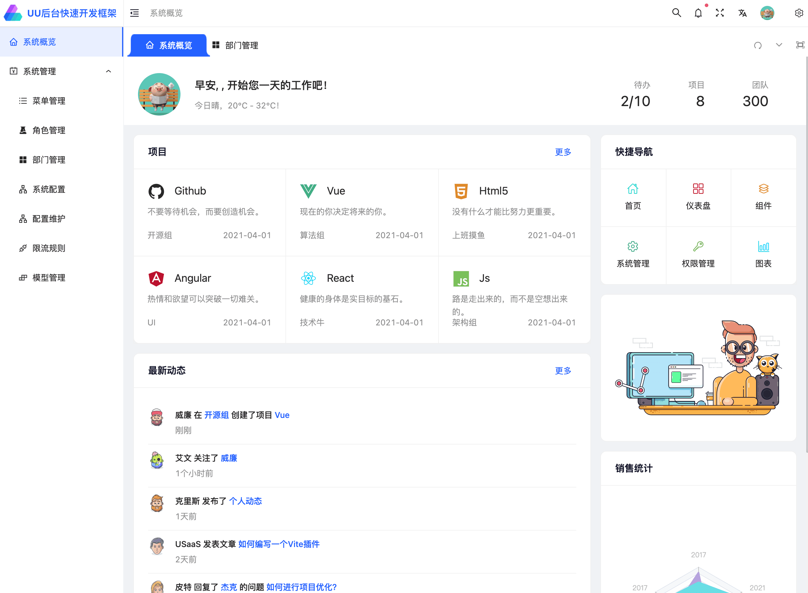
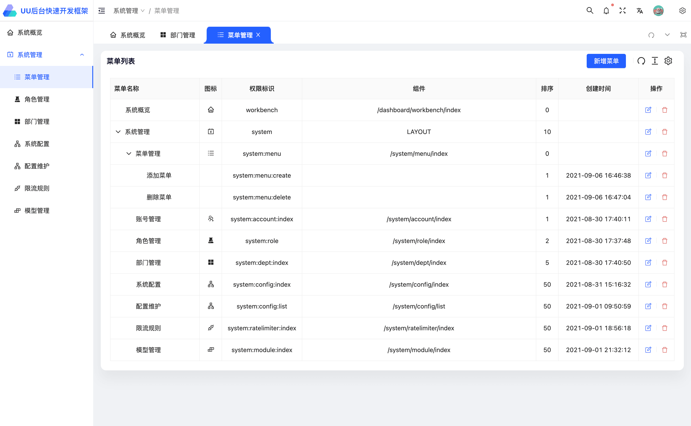
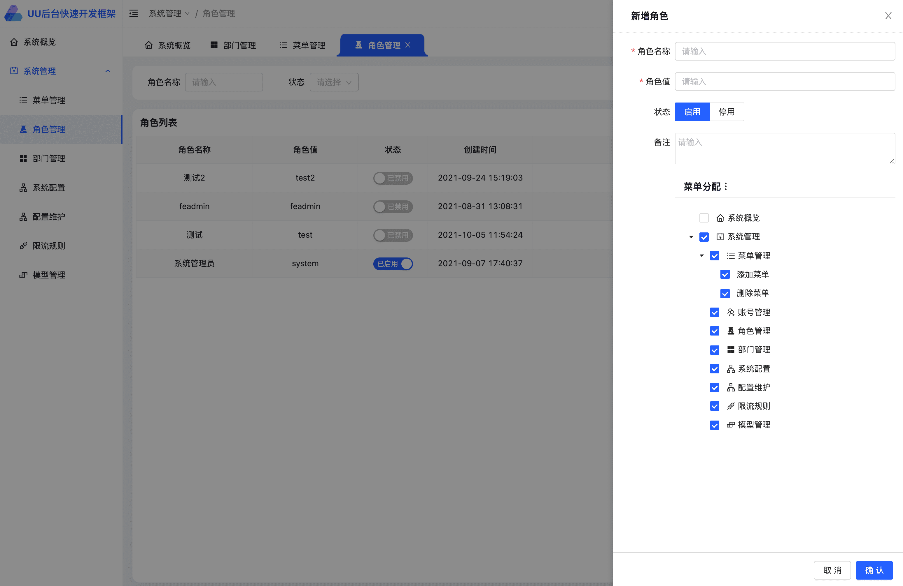
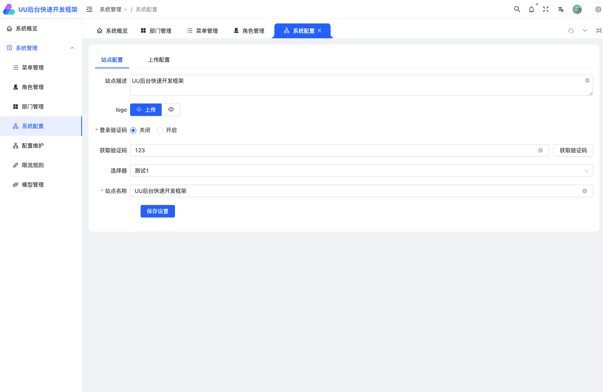
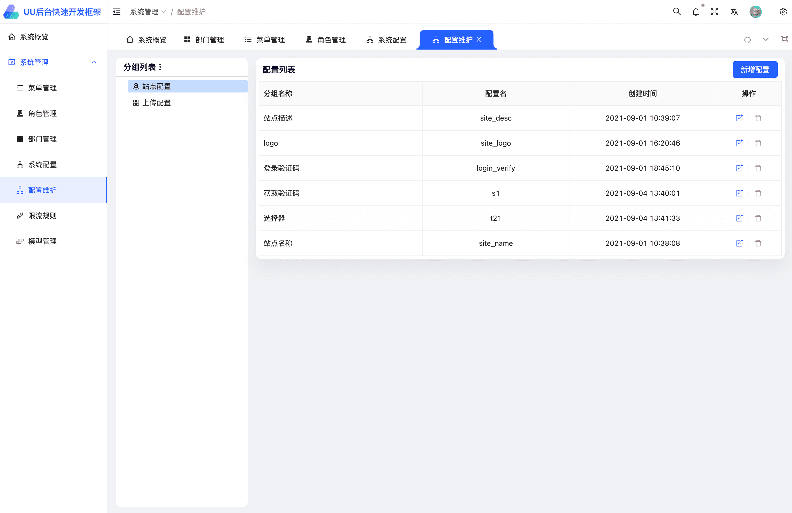

<div align="center"> <a href="https://github.com/uu-paotui/usaas-admin-frontend">  </a> <br> <br>

[](LICENSE)

<h1>USaaS Admin 插件式快速开发框架</h1>
</div>

基于vben(Vue3+、Vite、Ant Design),以插件形式开箱即用.

后端基于php8+swoole+hyperf2.2

## 安装vite
```js
  yarn add global vite
```

## 安装项目
```js
  git cline https://github.com/uu-paotui/usaas-admin-frontend
```

## 安装依赖
```js
yarn
```

## 运行
```js
yarn serve
```

## 编译
```js
yarn build
```

## 预览图片
系统概览


菜单管理


角色管理


系统配置


配置项系统维护



